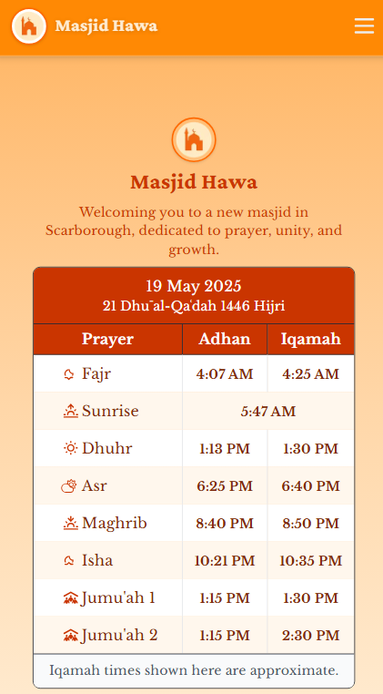

# Masjid Hawa Website 🌙

A responsive website built to improve the online presence of **Masjid Hawa**, a newly established mosque in Scarborough. Designed to provide accurate prayer times, community updates, and easy access to donation options for local visitors.

<p align="center">
  
</p>

## 🛠️ Tech Stack

- **Framework:** [Next.js](https://nextjs.org) with TypeScript
- **Styling:** [Tailwind CSS](https://tailwindcss.com) for utility-first design
- **API:** [Aladhan Prayer Times REST API](https://aladhan.com/prayer-times-api) to fetch daily Adhan times
- **Icons:** [React Icons](https://react-icons.github.io/react-icons/) for scalable icon components
- **Deployment:** [Vercel](https://vercel.com)

## 📌 Key Features
- Responsive design for all devices (mobile, tablet, desktop)
- Live daily prayer times with Adhan and Iqamah
- Community and services information
- Google Maps integration for location
- Donate button linking to external donation platform

## 🔗 API Usage
Prayer times are dynamically fetched from the [Aladhan API](https://aladhan.com/prayer-times-api), using Scarborough coordinates. The data is retrieved client-side in the `PrayerTimes` component and displayed in a formatted table, with Iqamah times calculated from Adhan times.

## 🚀 How to Clone and Run Locally

1. **Clone the repository:**
   ```bash
   git clone https://github.com/LethaXl/masjid-hawa.git
   cd masjid-hawa
   ```
2. **Install dependencies:**
   ```bash
   npm install
   ```
3. **Run the development server:**
   ```bash
   npm run dev
   ```
4. **Open your browser:**
   Visit [http://localhost:3000](http://localhost:3000) to view the site.

---
